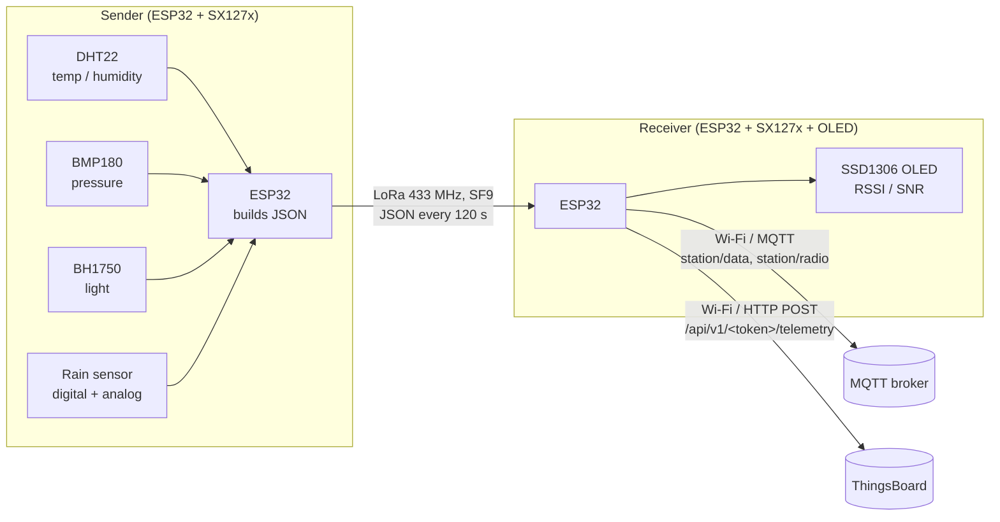

# LoRa Weather Station

A two-node, ESP32-based weather station that sends sensor readings over LoRa. A battery-friendly
**sender** reads temperature, humidity, barometric pressure, light level and rain status, then
sends them as a JSON packet every two minutes. A **receiver** (gateway) picks up the packets,
shows the link quality on an OLED display, and forwards both the weather data and the radio
statistics over Wi-Fi to an **MQTT broker** and to **ThingsBoard** (HTTP telemetry API).

It is meant for home-automation hobbyists who want outdoor weather data where Wi-Fi does not
reach, for example in a garden, on a roof or in a field.

## Table of contents

- [Features](#features)
- [How it works](#how-it-works)
- [Hardware](#hardware)
- [Wiring](#wiring)
- [Software and libraries](#software-and-libraries)
- [Configuration](#configuration)
- [Build and upload](#build-and-upload)
- [Usage](#usage)
- [Limitations and known issues](#limitations-and-known-issues)
- [Security notes](#security-notes)
- [Contributing](#contributing)
- [License](#license)

## Features

**Sender (`LoRa_Sender/LoRa_Sender.ino`)**

- Reads temperature and humidity from a **DHT22**.
- Reads barometric pressure (in hPa) from a **BMP180** (Adafruit BMP085 driver).
- Reads ambient light (in lux) from a **BH1750**.
- Reads rain status (digital) and rain intensity (analog) from a rain sensor module.
- Packs the readings into a JSON object and sends it over LoRa at 433 MHz, SF9, 20 dBm.
- Turns Wi-Fi off to save power, and blinks an LED while sending.
- Sends a new packet every 120 seconds.

**Receiver (`Lora_Receiver/Lora_Receiver.ino`)**

- Receives LoRa packets on the same band and spreading factor.
- Shows the RSSI and SNR of the last packet on a 128x64 **SSD1306** OLED.
- Publishes the raw weather JSON to the MQTT topic `station/data`.
- Publishes radio statistics (RSSI, SNR, spreading factor, frequency) to `station/radio`.
- Posts both JSON payloads to the ThingsBoard HTTP device telemetry API.
- Reconnects to the MQTT broker automatically when the connection drops.

## How it works



### Sender loop

1. Start the LoRa radio (433 MHz, TX power 20 dBm, SF9).
2. Read the DHT22. If the reading fails, print an error and start the loop again.
3. Read the rain sensor, the BH1750 and the BMP180.
4. Build the JSON payload, turn the LED on, send the packet, shut down the radio, turn the LED off.
5. Wait 120 seconds (`delay(120000)`).

### Payload format

The sender transmits one JSON object per packet (sent as plain text, not binary):

```json
{"Humidity":55.3,"Temperature":23.1,"light":812.5,"pressure":1012.84,"raining":"Not Raining"}
```

The values above are an example.

| Key | Type | Unit | Source |
|-----|------|------|--------|
| `Humidity` | number | % RH | DHT22 |
| `Temperature` | number | °C | DHT22 |
| `light` | number | lux | BH1750 |
| `pressure` | number | hPa | BMP180 (Pa / 100) |
| `raining` | string | `"Raining"` / `"Not Raining"` | Rain sensor digital output (`LOW` = raining) |

The analog rain intensity is read and printed to the serial monitor, but it is **not** included
in the payload.

### Radio statistics (receiver)

For every received packet the receiver builds and publishes a second JSON object (example values):

```json
{"rssi":-87,"snr":9.5,"sf":9,"frequency":433000000}
```

## Hardware

### Bill of materials

| Qty | Part | Used by | Notes |
|-----|------|---------|-------|
| 2 | ESP32 board with an SX1276/SX1278 LoRa radio | Sender, receiver | The pinout (SCK 5, MISO 19, MOSI 27, SS 18, RST 14, DIO0 26) matches the TTGO / LilyGO and Heltec LoRa32 boards. The common TTGO / Heltec LoRa32 boards with a built-in OLED use GPIO 4 as OLED SDA, which clashes with the receiver's `ledPin` 4 (and the sender's `DHTPIN` 4), so an external OLED or a different board is likely. <!-- TODO: verify exact board model/revision --> |
| 2 | 433 MHz antenna | Sender, receiver | Match the antenna to the band you set in `BAND`. |
| 1 | DHT22 (AM2302) temperature / humidity sensor | Sender | Plus a 10 kΩ pull-up on the data line if your module does not have one. |
| 1 | BMP180 barometric pressure sensor (I²C) | Sender | Driven by the Adafruit BMP085 library. |
| 1 | BH1750 light sensor (I²C) | Sender | |
| 1 | Rain sensor module with digital (DO) and analog (AO) outputs | Sender | For example the common "raindrop sensor" board with an LM393 comparator. |
| 1 | LED + resistor | Sender | Only if your board has no LED on GPIO 2. |
| 1 | SSD1306 128x64 I²C OLED (address `0x3C`) | Receiver | Built in on some LoRa32 boards. |
| 1 | LED + resistor | Receiver | Radio-statistics indicator on GPIO 4. |
| 2 | Power supply (USB or battery) | Sender, receiver | |

## Wiring

### LoRa radio (both sketches)

These are the SPI and control pins passed to `SPI.begin()` and `LoRa.setPins()`. On
LoRa32-style boards they are already wired on the PCB.

| SX127x pin | ESP32 GPIO | Define |
|------------|-----------|--------|
| SCK | 5 | `SCK` |
| MISO | 19 | `MISO` |
| MOSI | 27 | `MOSI` |
| NSS / CS | 18 | `SS` |
| RESET | 14 | `RST` |
| DIO0 | 26 | `DIO0` |

### Sender sensors

The I²C bus is started with `Wire.begin()` and no pin arguments, so it uses the board's default
I²C pins (GPIO 21 = SDA and GPIO 22 = SCL on a generic ESP32). <!-- TODO: verify I²C pins for the exact board -->

| Sensor | Sensor pin | ESP32 GPIO | Define |
|--------|-----------|-----------|--------|
| DHT22 | DATA | 4 | `DHTPIN` |
| BMP180 | SDA / SCL | Default I²C pins | — |
| BH1750 | SDA / SCL | Default I²C pins | — |
| Rain sensor | DO (digital) | 15 | `RAIN_SENSOR_DIGITAL_PIN` |
| Rain sensor | AO (analog) | 13 | `RAIN_SENSOR_ANALOG_PIN` |
| Status LED | Anode (through resistor) | 2 | `LED_PIN` |

Power all sensors from 3.3 V and connect all grounds together.

### Receiver peripherals

| Peripheral | Pin | ESP32 GPIO | Notes |
|------------|-----|-----------|-------|
| SSD1306 OLED | SDA / SCL | Default I²C pins | I²C address `0x3C`, no reset pin (`OLED_RESET = -1`). <!-- TODO: verify I²C pins for the exact board --> |
| Status LED | Anode (through resistor) | 4 | `ledPin` |

## Software and libraries

- [Arduino IDE](https://www.arduino.cc/en/software) with the **esp32** board package by
  Espressif Systems (Boards Manager). The `WiFi`, `HTTPClient`, `SPI` and `Wire` libraries come
  with it.
- Serial baud rate: **115200** for both sketches.

### Required libraries

| Library (Library Manager name) | Author | Sketch | Header |
|--------------------------------|--------|--------|--------|
| LoRa | Sandeep Mistry | Sender | `LoRa.h` |
| LoRa, **t0mer fork** (see below) | Sandeep Mistry, modified by t0mer | Receiver | `LoRa.h` |
| DHT sensor library | Adafruit | Sender | `DHT.h` |
| Adafruit Unified Sensor | Adafruit | Sender (dependency of DHT sensor library) | — |
| Adafruit BusIO | Adafruit | Both (dependency of Adafruit BMP085 Library and Adafruit SSD1306) | — |
| BH1750 | Christopher Laws | Sender | `BH1750.h` |
| Adafruit BMP085 Library | Adafruit | Sender | `Adafruit_BMP085.h` |
| ArduinoJson | Benoit Blanchon | Both | `ArduinoJson.h` |
| PubSubClient | Nick O'Leary | Receiver | `PubSubClient.h` |
| Adafruit SSD1306 | Adafruit | Receiver | `Adafruit_SSD1306.h` |
| Adafruit GFX Library | Adafruit | Receiver (also a dependency of Adafruit SSD1306) | `Adafruit_GFX.h` |

> [!IMPORTANT]
> The receiver calls `LoRa.getSpreadingFactor()` and `LoRa.getFrequency()`. In the upstream
> Sandeep Mistry LoRa library (0.8.0) `getSpreadingFactor()` is private and `getFrequency()` does
> not exist, so the receiver does not compile against it. Use the fork
> [t0mer/arduino-LoRa](https://github.com/t0mer/arduino-LoRa), which makes these functions
> public. Install it by downloading the repository as a ZIP and using
> **Sketch → Include Library → Add .ZIP Library…**, in place of the Library Manager version.
> The fork also works for the sender.

The sketches use the `DynamicJsonDocument` API, which is from **ArduinoJson 6**. ArduinoJson 7
still accepts it but marks it as deprecated. <!-- TODO: verify tested ArduinoJson version -->

## Configuration

All settings are compile-time constants at the top of each sketch. Edit them before uploading.

### Radio settings (both sketches)

The sender and receiver must use the same band, spreading factor and sync word.

| Setting | Where | Default | Notes |
|---------|-------|---------|-------|
| Frequency band | `#define BAND` | `433E6` (433 MHz) | Common alternatives: `868E6` (Europe), `915E6` (Americas). Must match your radio module and antenna. |
| Spreading factor | `LoRa.setSpreadingFactor(9)` | SF9 | Set in both sketches. |
| TX power | `int TX_POWER` (sender) | `20` dBm | Check your local legal limit (see below). |
| LNA gain | `LoRa.setGain(6)` (receiver) | `6` (lowest LNA gain, AGC off) | See [Limitations](#limitations-and-known-issues). |
| Sync word | Not set | Library default `0x12` | Change with `LoRa.setSyncWord()` in both sketches to keep other LoRa traffic out. |
| Bandwidth | Not set | Library default 125 kHz | |
| Coding rate | Not set | Library default 4/5 | |
| Preamble length | Not set | Library default 8 symbols | |
| CRC | Not set | Library default: off | |

> [!WARNING]
> **Use a frequency band that is legal in your region**, and stay within its power and duty-cycle
> limits. The 433 MHz, 868 MHz and 915 MHz bands are regulated differently in each country. In
> many regions 20 dBm is above the allowed limit (for example, the EU 433 MHz SRD band allows
> 10 mW ERP). Lower `TX_POWER` if needed.

### Sender settings

| Setting | Define / variable | Default | Description |
|---------|-------------------|---------|-------------|
| DHT data pin | `DHTPIN` | `4` | GPIO of the DHT data line. |
| DHT type | `DHTTYPE` | `DHT22` | Set to `DHT11` if you use a DHT11. |
| Rain digital pin | `RAIN_SENSOR_DIGITAL_PIN` | `15` | Rain sensor DO. `LOW` means rain. |
| Rain analog pin | `RAIN_SENSOR_ANALOG_PIN` | `13` | Rain sensor AO (printed to serial only). |
| LED pin | `LED_PIN` | `2` | On while a packet is sent. |
| Send interval | `delay(120000)` in `loop()` | 120 s | Time between packets. |
| Sleep time | `TIME_TO_SLEEP` | 120 s | Only used by `goToSleep()`, which is commented out (see [Limitations](#limitations-and-known-issues)). |

### Receiver settings

| Setting | Variable | Default | Description |
|---------|----------|---------|-------------|
| Wi-Fi SSID | `ssid` | `""` | Your Wi-Fi network name. |
| Wi-Fi password | `password` | `""` | Your Wi-Fi password. |
| MQTT broker | `mqtt_server` | `""` | Host name or IP of the MQTT broker. |
| MQTT port | `mqtt_port` | `1883` | Plain (non-TLS) MQTT port. |
| MQTT user | `mqtt_username` | `""` | Broker user name. |
| MQTT password | `mqtt_password` | `""` | Broker password. |
| MQTT client ID | `mqtt_clientid` | `wstation` | Must be unique on the broker. |
| Radio info topic | `mqtt_lora_info` | `station/radio` | RSSI / SNR / SF / frequency JSON. |
| Weather data topic | `mqtt_lora_payload` | `station/data` | Weather JSON received from the sender. |
| ThingsBoard server | `thingsboardServer` | `""` | Base URL **including the scheme**, for example `http://thingsboard.example.com:8080`. The code builds `<server>/api/v1/<token>/telemetry`. |
| ThingsBoard token | `accessToken` | `""` | Device access token from ThingsBoard. |
| LED pin | `ledPin` | `4` | On while the radio statistics are published; turned off before the weather payload is forwarded. |
| OLED size | `SCREEN_WIDTH`, `SCREEN_HEIGHT` | `128`, `64` | Display resolution. |
| OLED address | `display.begin(..., 0x3C)` | `0x3C` | Use `0x3D` for some 128x64 modules. |

Placeholder example (never commit real credentials):

```cpp
const char* ssid = "YOUR_WIFI_SSID";
const char* password = "YOUR_WIFI_PASSWORD";
const char* mqtt_server = "192.168.1.10";
const char* mqtt_username = "YOUR_MQTT_USER";
const char* mqtt_password = "YOUR_MQTT_PASSWORD";
const char* thingsboardServer = "http://thingsboard.example.com:8080";
const String accessToken = "YOUR_DEVICE_TOKEN";
```

## Build and upload

1. Install the Arduino IDE and add the ESP32 boards package:
   **File → Preferences → Additional boards manager URLs**:
   `https://espressif.github.io/arduino-esp32/package_esp32_index.json`, then install
   **esp32 by Espressif Systems** from **Tools → Board → Boards Manager**.
2. Install the libraries from [Software and libraries](#software-and-libraries), including the
   LoRa fork for the receiver.
3. Clone the repository:
   ```bash
   git clone https://github.com/t0mer/LoRa-Weather-Station.git
   ```
4. **Sender:** open `LoRa_Sender/LoRa_Sender.ino`, check the radio and pin settings, select your
   board (for example **TTGO LoRa32-OLED**) and port, then click **Upload**.
   <!-- TODO: verify board selection in Arduino IDE -->
5. **Receiver:** open `Lora_Receiver/Lora_Receiver.ino`, fill in the Wi-Fi, MQTT and ThingsBoard
   settings, select the board and port, then click **Upload**.
6. Open **Tools → Serial Monitor** at **115200** baud to watch each node.

## Usage

Power both nodes. The receiver connects to Wi-Fi and the MQTT broker, then waits for packets.
The sender sends one reading about every two minutes.

Subscribe to the topics to see the data, for example with Mosquitto:

```bash
mosquitto_sub -h <broker> -u <user> -P <password> -t 'station/#' -v
```

### Example serial output

Sender (example, derived from the sketch's `Serial.print` calls):

```text
Starting
BH1750 initialized.
BMP180 initialized.
Rain Intensity: 4095
Sending packet: {"Humidity":55.3,"Temperature":23.1,"light":812.5,"pressure":1012.84,"raining":"Not Raining"}
```

Receiver (example):

```text
LoRa Receiver Test
Connecting to WiFi
.....
WiFi connected
The client wstation connects to the public mqtt broker
Public mqtt broker connected
LoRa Initializing OK!
Received packet:
HTTP Response code: 200
HTTP Response code: 200
```

### Home automation

Any MQTT consumer can read `station/data`, for example Home Assistant MQTT sensors, Node-RED or
Telegraf. The keys are listed in [Payload format](#payload-format).

## Limitations and known issues

These come from reading the code. They are documented here, not fixed.

- **Upstream LoRa library does not compile the receiver.** See the note under
  [Required libraries](#required-libraries).
- **No deep sleep.** `goToSleep()` (light sleep, 120 s) is commented out, and the sender uses
  `delay(120000)` instead, so the ESP32 stays fully awake. `bootCount` and `dBmToMilliwatts()`
  are unused.
- **Fast retry on DHT failure.** If the DHT22 read fails, `loop()` returns at once and retries
  without a delay, restarting the LoRa radio each time.
- **Init failures halt the board.** On the sender, if the BH1750, BMP180 or LoRa radio fails to
  start, the sketch stops in an endless loop until reset. The receiver halts if LoRa init fails
  (or the OLED buffer can't be allocated).
- **Reduced receive sensitivity.** The receiver calls `LoRa.setGain(6)`, which selects the
  lowest LNA gain (SX1276 G6, about 48 dB below maximum) and turns AGC off. This reduces range;
  `LoRa.setGain(0)` (AGC on) or `1` (maximum gain) would be more sensitive.
- **Rain intensity is not sent.** The analog value is only printed to the serial monitor.
- **GPIO 15 is an ESP32 strapping pin.** A rain sensor pulling it low at boot can change boot
  behaviour. GPIO 13 is on ADC2, which works here only because the sender turns Wi-Fi off.
- **Misleading comments in the sender.** The DHT comments say "DHT11", but the code uses
  `DHT22`. `LoRa.h` is included twice.
- **Blocking reconnects on the receiver.** Wi-Fi setup and MQTT reconnect loop until they
  succeed. Packets that arrive during an MQTT reconnect are lost, and a lost Wi-Fi connection is
  not re-established explicitly.
- **Radio statistics are mixed into ThingsBoard telemetry.** The receiver posts both the radio
  JSON and the weather JSON to the same ThingsBoard device.
- **ThingsBoard is always called.** If `thingsboardServer` is empty, the HTTP request fails on
  every packet and the error code is printed. The example in the code comment
  (`"demo.thingsboard.io"`) has no `http://` scheme, which `HTTPClient` needs.
- **The OLED only shows RSSI and SNR**, not the weather values.
- **No packet validation.** There is no CRC, no sender ID and no check that the payload is valid
  JSON; any LoRa packet on the same settings is forwarded to MQTT and ThingsBoard.
- **Fixed MQTT client ID** (`wstation`). A second receiver with the same ID disconnects the
  first.

## Security notes

- **LoRa payloads are not encrypted or authenticated.** Anyone in range with a LoRa radio on the
  same settings can read the weather data or inject fake packets, which the receiver forwards
  unchanged to MQTT and ThingsBoard.
- **MQTT uses plain TCP on port 1883** with no TLS, so the broker user name and password travel
  in clear text on your network.
- **The ThingsBoard access token is part of the URL**, and the code uses plain `HTTPClient`
  without TLS certificates. Use a server on your own network, or add HTTPS support.
- **Credentials are hard-coded** in the receiver sketch. Do not commit a sketch with real
  credentials to a public repository.

## Contributing

Issues and pull requests are welcome. Please describe the board and library versions you tested
with.

## License

This project is licensed under the [Apache License 2.0](LICENSE).
